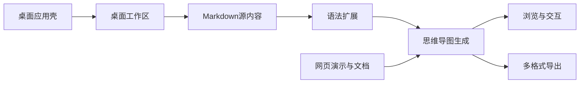
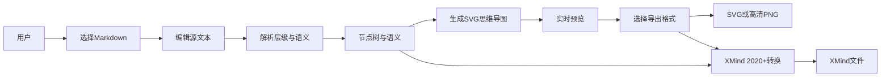
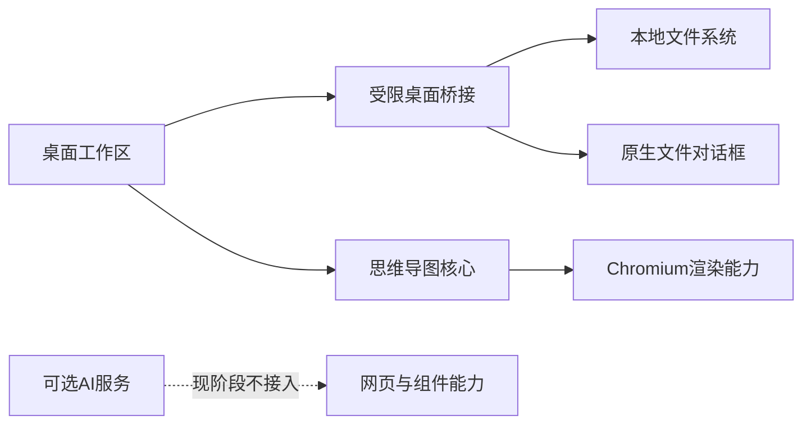
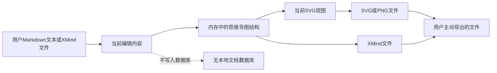

# Open MindMap — 模块说明文档

> 本文档说明系统的业务功能设计、模块边界和协作关系。
> `doc/项目结构文档.md` 负责说明代码组织，本文档负责说明业务模块如何支撑产品能力。
> 建议先阅读本文档了解产品边界，再阅读项目结构文档定位具体实现。
> 更新日期：2026-09-06
>
> **项目基础信息**
>
> | 类别 | 技术栈与版本 | 用途 |
> |---|---|---|
> | 公共组件库 | React 19.2.4 | 提供可嵌入的思维导图组件与网页演示 |
> | 桌面界面 | React 19.2.4 + TypeScript 5.9.3 | 构建桌面工作区界面 |
> | 网页与桌面前端构建 | Vite 8.0.0 | 构建网页演示和 Electron Renderer |
> | 桌面运行时 | Electron 44.2.0 | 提供 macOS 桌面窗口和本地系统能力 |
> | 桌面构建工具 | Electron Forge 7.11.2、Forge Vite 插件 7.11.2 | 管理 Electron 开发期构建 |
> | 文件输出 | XMind 2020+、SVG、浏览器 Canvas PNG 转换 | 生成可继续编辑的思维导图文件、无损矢量图和高清位图 |
> | 语法扩展 | 内置 MindMap 插件机制 | 支持任务状态、标签、折叠、交叉链接、LaTeX 等扩展语法 |
> | 按需数学渲染 | MathJax `4.1.3` | 本地 TeX 字形生成纯 SVG 路径，预览和 PNG 导出复用尺寸及字形 |
> | 图标与界面辅助 | lucide-react 1.20.0 | 提供网页和桌面界面的图标 |
> | 测试工具 | Vitest 4.1.8、Playwright 1.60.0 | 验证核心解析、布局、导出和网页交互 |
> | 包管理 | pnpm，版本未在依赖清单中固定 | 管理根项目和桌面子应用依赖 |
> | 后端与数据库 | 无 | 当前版本不依赖后端服务或数据库 |

---

## 1. 文档定位

本文档面向需要理解产品边界、业务功能和模块协作关系的开发者。它从用户目标出发说明系统如何完成 Markdown/XMind 到思维导图的转换，以及桌面端如何承载导入和导出能力。

本文档不承担文件定位和逐文件说明；具体实现位置应在阅读完模块边界后，通过 `doc/项目结构文档.md` 的快速索引查找。当前桌面端首版的范围以本地 XMind 导入、Markdown 编辑、实时生成和多格式导出为准，AI、云同步、数据库和安装包发布不属于本阶段桌面功能。

## 2. 系统功能定位

Open MindMap 是一个以 Markdown 为编辑内容源、以 SVG 为主要呈现形式的思维导图创作工具；桌面工作区支持 XMind 导入与导出，同时提供可嵌入 React 应用的思维导图组件库。

系统围绕以下能力方向设计：

| 能力方向 | 业务目标 |
|---|---|
| Markdown 内容创作 | 让用户用熟悉的层级文本快速表达主题、分支和备注 |
| 思维导图生成 | 将文本层级即时转换为可浏览、可缩放的视觉结构 |
| 语法扩展 | 在不改变基本文本习惯的前提下表达任务、标签、折叠、链接和数学内容 |
| 导出 | 将当前思维导图输出为适合继续编辑、分享或排版的 XMind、SVG 与高清 PNG |
| 桌面本地工作区 | 通过原生文件选择导入/导出 XMind，并通过 Markdown 编辑和保存能力完成本地创作 |
| 可复用组件能力 | 允许其他 React 应用嵌入思维导图、只读查看器或导出能力 |
| 在线演示与文档 | 让用户在浏览器中了解语法、配置方式和交互能力 |

## 3. 端侧职责划分

| 端侧或运行环境 | 职责定位 | 设计关注点 |
|---|---|---|
| Electron 桌面壳 | 管理桌面窗口、原生文件对话框、菜单和本地文件输出 | 系统能力只通过受限桥接提供；不承担思维导图业务规则 |
| 桌面工作区界面 | 提供 Markdown 编辑、实时预览和导出操作 | 以统一工作区承载源文本和视觉结果；Markdown 编辑区可收缩，地图区域可最大化 |
| React 思维导图核心 | 完成文本解析、树结构处理、布局计算、SVG 渲染和交互 | 保持浏览器可运行、可复用和与桌面壳解耦 |
| 网页演示与文档 | 展示组件能力、扩展语法和可交互示例 | 面向浏览器使用场景，不依赖 Electron 原生能力 |
| 本地文件系统 | 提供用户选定的 Markdown 输入和 SVG/PNG/XMind 输出位置 | 文件访问由桌面壳发起，用户取消和读写失败必须可见 |
| 外部服务 | 当前桌面首版无外部服务依赖 | 仓库中保留的 AI 能力属于现有组件/网页能力，不接入本阶段桌面闭环 |
| 本地数据库 | 当前没有数据库职责 | 文档内容在当前工作区中只存在于编辑状态和用户主动导出的文件中 |

## 4. 功能模块总览

| 模块 | 定位 | 核心产出 | 直接依赖 |
|---|---|---|---|
| 桌面应用壳 | 把网页能力组织成可操作的 macOS 本地窗口 | 窗口、菜单、文件选择和本地输出 | 桌面工作区、操作系统文件能力 |
| Markdown 源内容 | 接收和维护用户的层级文本 | 当前 Markdown 文本、导入结果 | 桌面应用壳、语法扩展 |
| 思维导图生成 | 将源内容转换为可视化树图 | 节点、连线、布局和 SVG 画布 | Markdown 源内容、通用解析与布局能力 |
| 语法扩展 | 丰富节点的语义和表现 | 标签、任务状态、备注、折叠、交叉链接等 | Markdown 源内容、思维导图生成 |
| 导出 | 将当前结构和可视化结果转换为外部文件 | XMind、SVG、高清 PNG | 思维导图生成、主题与布局能力、桌面应用壳 |
| 浏览与交互 | 帮助用户理解和查看较大的思维导图 | 缩放、平移、标签过滤、主题切换 | 思维导图生成、界面支撑能力 |
| 网页演示与文档 | 说明和展示公共组件能力 | 官网、Live 演示、API 与语法说明 | 思维导图核心、文档界面支撑 |
| AI 生成支撑 | 为现有组件和网页提供可选的模型流式生成能力 | AI 返回的 Markdown 思维导图 | 外部 AI Provider、Markdown 源内容；桌面首版不启用 |

## 5. 各业务模块说明

### 5.1 桌面应用壳

**定位**：为本地 Markdown/XMind 思维导图提供原生窗口和操作系统文件能力，使用户可以导入 XMind、编辑 Markdown 并保存 XMind 文件或图像结果。

**核心功能**：

- 打开独立的 macOS 思维导图窗口；
- 提供导入 XMind 的原生文件选择，并转换为 Markdown；
- 提供 XMind、SVG 和 PNG 的原生保存位置选择；
- 将菜单和快捷键转换为桌面工作区操作；
- 管理 Renderer 与本地系统之间的受限通信；
- 处理文件取消、超限、读写失败等桌面错误。

**设计边界**：

- 不负责 Markdown 语法解析和思维导图布局；
- 不直接修改思维导图节点数据；
- 当前不承担 Markdown 回写、数据库、云同步和 AI 请求；
- 不把 Node.js 文件系统能力直接暴露给界面。

**依赖与协作**：

- 依赖桌面工作区完成用户操作和状态展示；
- 被 Markdown 源内容和导出模块使用；
- 通过本地文件系统完成输入和输出；
- 与 React 思维导图核心保持能力解耦。

**开发关注点**：

- 所有系统能力通过最小化的桥接方法暴露；
- 用户取消对话框不应被当作错误；
- 文件名必须经过安全清理，不能把用户输入当作路径；
- 生产窗口只能加载随应用发布的本地资源；
- 桌面菜单和界面按钮应保持相同的业务命名。

### 5.2 Markdown 源内容

**定位**：为用户提供可读、可编辑、可导入的思维导图源文本，并作为桌面首版的唯一内容来源。

**核心功能**：

- 编辑根主题、分支和多级子节点；
- 将 XMind 文件转换为可编辑的 Markdown 内容；
- 对层级缩进和列表标记进行实时解析；
- 在编辑过程中保持语法高亮和文本可读性；
- 将源文本变化传递给思维导图生成模块；
- 支持多个根主题和备注等文本表达方式；
- 支持在桌面工作区中隐藏或恢复 Markdown 编辑区域。

**设计边界**：

- 不负责决定节点在画布上的具体位置；
- 不负责写入导出文件；
- 不把视觉画布状态反向当作源文本；
- 桌面首版不引入账户、同步和历史文件数据库。

**依赖与协作**：

- 依赖桌面应用壳获取 XMind 文件并转换为 Markdown；
- 依赖语法扩展解释增强标记；
- 驱动思维导图生成和浏览交互；
- 导出模块读取解析后的当前内容。

**开发关注点**：

- Markdown 文本必须始终能够独立表达核心结构；
- 编辑器和解析器要保持缩进规则一致；
- 导入大文件时应有明确大小边界和可理解的错误提示；
- 解析失败或空内容应提供稳定的可继续编辑状态；
- 新增语法应考虑文本往返和现有文档兼容性。

### 5.3 思维导图生成

**定位**：把 Markdown 的层级语义转换成节点、连接线和可缩放的视觉地图。

**核心功能**：

- 生成根节点和多级分支；
- 根据文本和主题计算节点尺寸；
- 计算左右或平衡布局；
- 以 SVG 呈现节点、连接线和扩展装饰；
- 在源内容变化时重新生成地图；
- 为查看、标签过滤和导出提供统一的视觉结果。

**设计边界**：

- 不负责选择本地文件或决定导出路径；
- 不负责保存用户文档；
- 不承担桌面窗口生命周期；
- 桌面工作区支持点击选中节点、双击或快捷键编辑、删除，以及同级排序、跨侧移动和拖拽重新挂载层级；可视化修改会同步序列化回左侧 Markdown。

**依赖与协作**：

- 依赖 Markdown 源内容和语法扩展提供结构；
- 为浏览与交互模块提供可操作画布；
- 为导出模块提供完整视觉结果；
- 被网页演示与文档示例复用。

**开发关注点**：

- 布局计算必须与屏幕显示和导出结果保持一致；
- 文本测量、超长节点和多根树需要有稳定行为；
- 纯 SVG 结构应保留语义 class 和主题信息；
- 重新生成时不能破坏输入内容；
- 大型树图需要关注布局耗时和浏览器内存。

### 5.4 语法扩展

**定位**：在基本 Markdown 层级之外表达节点状态、关系和展示方式，使同一份文本可以承载更多思维组织信息。

**核心功能**：

- 使用任务标记表达待办、进行中和已完成状态；
- 使用备注表达不适合独立成节点的补充信息；
- 使用标签进行视觉分类和过滤；
- 使用折叠标记控制分支初始可见性；
- 使用多行内容表达节点的补充段落；
- 使用交叉链接表达非树状关系；
- 使用前置元数据表达主题和布局方向；
- 使用 `$...$` 表达不跨行的行内公式，使用同行或标准跨行的 `$$...$$` 表达块级公式；跨行公式作为前一节点的完整补充内容解析。

**设计边界**：

- 不改变 Markdown 作为主内容格式的定位；
- 不独立保存插件配置或用户账户数据；
- 不绕过思维导图生成模块直接绘制画布；
- 桌面首版只消费已有扩展能力，不新增插件市场。

**依赖与协作**：

- 依赖 Markdown 源内容触发解析和序列化；
- 参与节点生成、布局、渲染和导出；
- 被标签过滤和导出共同消费。

**开发关注点**：

- 每个扩展都应定义清晰的文本语义和展示语义；
- 插件执行顺序不能造成不可预测的文本往返；
- 扩展字段应保持可选，避免破坏基础节点；
- 导出时应保留必要的视觉语义；
- 不应为了展示效果强迫用户使用扩展语法。

### 5.5 导出

**定位**：把当前思维导图输出为可继续编辑、可分享、可继续排版或可被其他工具处理的文件。

**核心功能**：

- 将当前 Markdown 解析得到的节点树导出为 XMind 2020+ 文件；
- 导出带主题和结构信息的 SVG；
- 导出高分辨率 PNG；
- 允许用户选择 PNG 的 2 倍、3 倍或 4 倍比例；
- XMind 导出保留节点树及可映射的备注、标签、任务状态、折叠和链接语义；
- SVG/PNG 导出保持节点文字、连接线和插件装饰的一致性；
- 通过原生保存对话框选择输出位置；
- 在写入时处理取消和失败状态。

**XMind 映射约定**：

- 每个 Markdown 根节点导出为一个 XMind Sheet；
- 节点文本会移除内联 Markdown 标记，首个链接映射为超链接，首个图片映射为 XMind 图片；
- `>` 备注和 `|` 多行内容合并为 XMind 备注；
- `#标签` 映射为 XMind 标签；`[ ]`、`[-]`、`[x]` 映射为任务进度；
- `+` 折叠标记映射为 XMind 折叠状态；
- 虚线关系、跨节点连线、frontmatter 方向/主题和 LaTeX 的视觉样式不保证写入 XMind。

**设计边界**：

- 不负责改变源 Markdown；
- 不负责选择或解析输入文件；
- XMind 导出不承诺保留 CSS 主题、当前画布方向、跨节点连线或所有内联视觉样式；
- 不把 PNG 作为唯一输出格式；
- 不承诺无限大的位图输出，超大地图需要遵守 Canvas 限制。

**依赖与协作**：

- 依赖思维导图生成模块提供节点、连接线和当前结构；
- 依赖主题和语法扩展提供输出样式或可映射的节点语义；
- 依赖 XMind 转换器生成可打开的 XMind 文件；
- 依赖桌面应用壳完成目标文件写入；
- 网页组件也可以独立使用 SVG/PNG 等浏览器导出能力。

**开发关注点**：

- XMind 输出必须是可被 XMind 2020+ 打开的有效 XMind ZIP 包，并明确记录节点语义映射边界；
- SVG 应作为高清和无损场景的优先格式；
- PNG 缩放比例必须影响真实像素尺寸；
- 大图导出前应评估像素上限和内存风险；
- 外部图片或特殊 SVG 内容需要考虑 Canvas 安全限制；
- 导出文件名和扩展名必须稳定且可预测。

### 5.6 浏览与交互

**定位**：帮助用户在不同规模和不同主题的地图中定位内容、理解关系和调整阅读视角。

**核心功能**：

- 平移画布和缩放视图；
- 自动适配全部节点；
- 按标签过滤和弱化无关分支；
- 切换左侧、右侧或平衡布局；
- 自动跟随系统或用户指定的明暗主题；
- 支持桌面工作区中的 Markdown 编辑区收缩与地图区域最大化；
- 为公共组件提供键盘操作和只读查看能力。

**设计边界**：

- 不改变 Markdown 的源文本语义；
- 不代替导出模块生成外部文件；
- 不把短暂的缩放和平移状态当作文档内容；
- 桌面首版不扩展多窗口或多标签管理。

**依赖与协作**：

- 依赖思维导图生成模块提供节点索引和画布；
- 依赖通用主题、国际化和状态支撑；
- 为桌面工作区和网页演示提供统一阅读体验。

**开发关注点**：

- 交互反馈应清晰区分选中、匹配、折叠和过滤状态；
- 键盘焦点必须可见且不能被浮层吞掉；
- 主题变化不能破坏导出样式的一致性；
- 触控、鼠标和键盘行为要避免互相覆盖；
- 减少不必要的动画，尊重系统的减少动态效果设置。

### 5.7 网页演示与文档

**定位**：展示公共 React 组件的使用方式、语法能力和交互效果，承担项目的浏览器入口与说明入口。

**核心功能**：

- 展示项目定位和核心特性；
- 提供可直接操作的在线思维导图演示；
- 说明基本 Markdown 和扩展语法；
- 说明主题、样式、只读查看和导出能力；
- 展示公共组件的接口与工具能力；
- 提供网页端的响应式和触控示例。

**设计边界**：

- 不依赖桌面原生文件系统；
- 不代表桌面端的全部工作区体验；
- 不把网页演示中的远程 AI 能力视为桌面首版功能；
- 不承担用户本地文档管理。

**依赖与协作**：

- 依赖思维导图核心和公共导出能力；
- 依赖语法扩展、主题和国际化说明；
- 为组件库用户提供能力验证和学习入口。

**开发关注点**：

- 网页演示与公共组件行为必须保持一致；
- 文档中的语法说明不能超出实际解析能力；
- 示例内容应避免泄露真实密钥或外部服务配置；
- 桌面专属行为应在文档中明确标注环境边界。

### 5.8 AI 生成支撑

**定位**：为现有 React 组件和网页演示提供可选的自然语言到 Markdown 思维导图能力。

**核心功能**：

- 接收自然语言输入；
- 对接兼容接口并接收流式 Markdown；
- 将流式结果逐步更新为思维导图；
- 支持文本、图片和 PDF 等输入类型；
- 支持自定义请求适配和系统提示词。

**设计边界**：

- 不属于当前桌面首版功能；
- 不应把 API Key 直接作为桌面 Renderer 的长期配置；
- 不负责桌面端本地文件导入和多格式导出；
- 不替代 Markdown 源内容模块。

**依赖与协作**：

- 依赖外部 AI Provider 的网络和响应格式；
- 依赖 Markdown 解析与思维导图生成；
- 当前主要服务公共组件和网页演示。

**开发关注点**：

- 必须明确网络失败、取消和部分结果的行为；
- 外部服务的密钥不能写入示例或提交到仓库；
- 流式结果必须经过文本清理和结构校验；
- 后续如接入桌面端，应重新设计主进程代理和密钥存储边界。

## 6. 通用支撑能力

### 6.1 文本解析与数据规范化

负责把 Markdown 或导入数据转换为稳定的树结构，并清理无效或不完整的节点关系。

开发时应避免：让桌面壳自行解析 Markdown，或在不同端实现两套互不一致的层级规则。

### 6.2 布局与文本测量

负责根据节点内容、层级、主题和布局方向计算节点尺寸、位置以及连接线路径。

开发时应避免：单独为导出实现另一套布局，导致屏幕看到的地图与导出的地图不一致。

### 6.3 状态、历史与异步反馈

负责源文本变化、当前视图、标签筛选状态、加载状态、导出状态和错误状态的组织。

开发时应避免：把“用户取消”当成失败，或让短暂的视图状态污染 Markdown 内容。

### 6.4 主题、国际化与界面约定

负责明暗主题、颜色变量、界面文本、键盘焦点和减少动态效果等跨模块体验。

开发时应避免：只修改桌面外层颜色而忽略 SVG 节点、连接线和导出结果的主题一致性。

### 6.5 桌面安全边界

负责把本地文件能力限制在 Electron Main 进程，通过 Preload 暴露最小业务 API，并阻止 Renderer 任意访问系统能力。

开发时应避免：开启 Renderer 的 Node.js 集成、暴露完整 IPC 对象、加载未经验证的远程页面或把用户输入直接拼接为路径。

### 6.6 输出与错误处理

负责导入、解析、渲染、导出各阶段的可理解错误提示，以及导出文件的原子写入。

开发时应避免：只依赖命令退出码判断成功，不检查实际输出文件，也不向用户解释超大图片或无效文本的处理结果。

## 7. 模块间关键关系

### 7.1 模块依赖关系

该图表示桌面壳只负责系统能力，业务内容由 Markdown、语法扩展和思维导图生成共同完成，网页端与桌面端共享核心视觉能力。

### 7.2 Markdown 到导出的核心业务流

该图表示 SVG/PNG 导出复用布局和视觉结果，XMind 导出则从同一份解析节点树构建可继续编辑的结构，不重新解析 Markdown。

### 7.3 桌面能力与外部依赖

该图区分了当前桌面首版的本地闭环和仓库中仍存在的可选 AI 能力，桌面端不因 AI 服务不可用而影响 XMind 导入、Markdown 编辑、生成和导出。

### 7.4 用户数据生命周期

该图表示当前桌面首版不建立文档数据库，输入文件和导出文件由用户控制；SVG/PNG 面向视觉输出，XMind 面向结构化编辑，应用内状态只承担当前工作区的解析与展示。

## 8. 典型业务闭环

### 8.1 导入 XMind 并生成思维导图

1. 用户在桌面工作区选择导入 XMind。
2. 系统通过原生文件选择让用户选定 `.xmind` 文件。
3. 桌面壳读取 XMind 画布，并将主题树转换为 Markdown 大纲。
4. 工作区将转换后的 Markdown 写入左侧编辑器。
5. 解析能力识别层级、备注、链接和任务状态等可映射语义。
6. 思维导图生成模块计算布局并更新 SVG 视图；多个画布会按画布名称分组。

### 8.2 编辑 Markdown 并实时查看结果

1. 用户在源文本区域修改主题或分支层级。
2. 编辑器保留 Markdown 文本和语法高亮。
3. 解析能力重新生成内存中的树结构。
4. 视觉模块重新计算节点和连接线。
5. 预览区展示更新后的思维导图。
6. 用户可以继续修改文本，直到结构满足预期。

### 8.3 导出思维导图文件

1. 用户确认当前预览内容和主题样式。
2. 用户选择导出 XMind、SVG 或 PNG。
3. XMind 导出将当前节点树转换为 XMind 2020+ 文件；SVG 导出直接生成矢量内容；PNG 导出根据用户选择的比例生成位图。
4. 系统检查输出内容和目标文件名。
5. 用户在原生保存对话框中选择目标位置。
6. 桌面壳完成文件写入并反馈结果；用户取消时保留当前工作区不变。

## 9. 后续开发参考原则

1. 桌面首版始终以 Markdown 源文本作为内容真相，不把缩放、平移或临时选择状态写入源文本。
2. Markdown 解析、树结构、布局和 SVG 生成应由共享核心统一提供，不在桌面壳中复制实现。
3. Electron Main 只提供明确的文件和窗口能力，Renderer 不直接访问 Node.js 或本地文件系统。
4. 导入和导出都必须允许用户取消，并且取消不能清空或覆盖当前内容。
5. XMind 导出应保留可编辑的节点结构；SVG 作为无损高清输出的优先格式，PNG 必须明确标注比例并处理超大尺寸风险。
6. 新增 Markdown 语法时，必须同时考虑解析、显示、导出和文本往返的一致性。
7. 当前范围不引入数据库、云同步或后端服务；只有当产品目标改变时才重新评估数据层。
8. 桌面端界面可以重新组织体验，但不能改变公共组件对 Markdown 语义和导出结果的基本约定。
9. 网页演示、公共组件和桌面工作区的功能差异必须在文档和界面文案中明确标注。
10. 任何涉及系统权限、远程内容或用户文件的能力，都应先明确边界、失败处理和可回滚行为。
